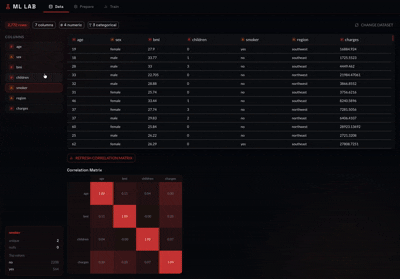

# ML Lab

Interactive machine learning sandbox for experimenting with regression, clustering, and anomaly detection. Load a dataset, preprocess it, train a model, and explore the results — no code required.

Live: https://ml-lab.maxharrison.xyz


---

## Stack

- **Frontend** — React, Vite, Material UI, Recharts
- **Backend** — FastAPI, scikit-learn, pandas
- **Models** — Linear Regression, Decision Tree, Random Forest, DBSCAN, Isolation Forest

---

## Features

**Data tab** — load datasets via example, URL, Kaggle slug, or CSV upload. Column browser shows type, null counts, and per-column stats. Correlation matrix on demand.

**Prepare tab** — missing value handling (drop or impute), one-hot encoding for categoricals, feature scaling, IQR outlier removal. Detects issues automatically.

**Train tab** — pick task (regression / clustering / anomaly detection), select features, tune hyperparameters, train and view results. Metrics, scatter, and line plots for regression; PCA 2D plots for clustering and anomaly detection.

---

## Project structure

```
ML-Lab/
  app/                  # original model code (scikit-learn)
    models/
    example_datasets/
    utils.py
  backend/
    main.py             # FastAPI — wraps the models, serves the frontend in prod
    requirements.txt
  frontend/
    src/
      api.js
      hooks/            # useDataset, useTrain
      components/       # DataTab, PrepareTab, TrainTab, charts, ErrorBoundary
```

---

## Running locally

```bash
git clone https://github.com/minvoker/ML-Lab.git
cd ML-Lab
```

Install dependencies first:
```bash
cd backend && python -m venv venv && source venv/bin/activate && pip install -r requirements.txt
cd ../frontend && npm install
```

Then from the root:
```bash
./start.sh
```

App runs at `http://localhost:5173`, API at `http://localhost:8000`.
